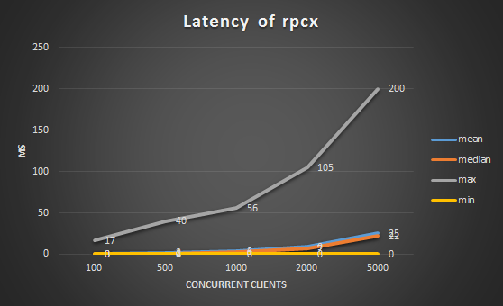

<a href="https://rpcx.site/"></a>

[**中文介绍**](README-CN.md)

[](http://godoc.org/github.com/smallnest/rpcx) [](https://drone.io/github.com/smallnest/rpcx/latest) [](https://goreportcard.com/report/github.com/smallnest/rpcx)

rpcx is a distributed RPC framework like [Alibaba Dubbo](http://dubbo.io/) and [Weibo Motan](https://github.com/weibocom/motan).
It is developed based on Go net/rpc and provides extra governance features.





When we talk about RPC frameworks, Dubbo is first framework we should introduced, and there is also Dubbox mantained by dangdang.
Dubbo has been widely used in e-commerce companies in China, for example, Alibaba, Jingdong and Dangdang.

Though Dubbo has still used Spring 2.5.6.SEC03 and seems has not been supported by Alibaba no longer, 
some other companies still use it and maintained their branches.

> DUBBO is a distributed service framework , provides high performance and transparent RPC remote service call. 
> It is the core framework of Alibaba SOA service governance programs. 
> There are 3,000,000,000 calls for 2,000+ services per day, 
> and it has been widely used in various member sites of Alibaba Group.

Motan is open source now by Weibo. As Zhang Lei said, he is current main developer of Motan:

> Motan started in 2013. There are 100 billion calls for hundreds of service callsevery day.

Those two RPC frameworks are developed by Java. 
There are other famous RPC frameworks such as [thrift](https://thrift.apache.org/)、[finagle](https://github.com/twitter/finagle)。

Goal of [rpcx](https://github.com/smallnest/rpcx) is implemented a RPC framework like Dubbo in Go ecosphere.
It is developed by Go, and for Go. 

It is a distributed、plugable RPC framework with governance (service discovery、load balancer、fault tolerance、monitor, etc.).

As you know, there are some RPC frameworks, for example, [net/rpc](https://golang.org/pkg/net/rpc/)、[grpc-go](https://github.com/grpc/grpc-go)、[gorilla-rpc](http://www.gorillatoolkit.org/pkg/rpc),
Then why re-invent a wheel?

Although those Go RPC frameworks work well, but their function is relatively simple and only implement end-to end communications.
Some product features of service management functions are lack, such as service discovery,
Load balancing, fault tolerance. 

So I created rpcx and expect it could become a RPC framework like Dubbo.


The similar project is [go-micro](https://github.com/micro/go-micro). 


## What's RPC
From wikiPedia:

> In distributed computing, a remote procedure call (RPC) is when a computer program causes a procedure (subroutine) to execute in another address space (commonly on another computer on a shared network), which is coded as if it were a normal (local) procedure call, without the programmer explicitly coding the details for the remote interaction. That is, the programmer writes essentially the same code whether the subroutine is local to the executing program, or remote.[1] This is a form of client–server interaction (caller is client, executer is server), typically implemented via a request–response message-passing system. The object-oriented programming analog is remote method invocation (RMI). The RPC model implies a level of location transparency, namely that calling procedures is largely the same whether it is local or remote, but usually they are not identical, so local calls can be distinguished from remote calls. Remote calls are usually orders of magnitude slower and less reliable than local calls, so distinguishing them is useful.
>
>RPCs are a form of inter-process communication (IPC), in that different processes have different address spaces: if on the same host machine, they have distinct virtual address spaces, even though the physical address space is the same; while if they are on different hosts, the physical address space is different. Many different (often incompatible) technologies have been used to implement the concept.


Sequence of events during an RPC
1. The client calls the client stub. The call is a local procedure call, with parameters pushed on to the stack in the normal way.
2. The client stub packs the parameters into a message and makes a system call to send the message. Packing the parameters is called marshalling.
3. The client's local operating system sends the message from the client machine to the server machine.
4. The local operating system on the server machine passes the incoming packets to the server stub.
5. The server stub unpacks the parameters from the message. Unpacking the parameters is called unmarshalling.
6. Finally, the server stub calls the server procedure. The reply traces the same steps in the reverse direction.


There are two ways to implement RPC frameworks. 
One focusses on cross-language calls and the other focusses on service governance.

Dubbo、DubboX、Motan are RPC framework of service governance .
Thrift、gRPC、Hessian、Hprose are RPC framework of cross-language calls.

rpcx is a RPC framework of service governance.

## Features

[more features](feature)


* bases on net/rpc. a Go net/prc project can be converted rpcx project whit few changes.
* Plugable. Features are implemented by Plugins such as service discovery.
* Commnuicates with TCP long connections.
* support many codec. for example, Gob、Json、MessagePack、gencode、ProtoBuf.
* Service dicovery. support ZooKeeper、Etcd.
* Fault tolerance：Failover、Failfast、Failtry.
* Load banlancer：support randomSelecter, RoundRobin, consistent hash etc.
* scalable.
* Other: metrics、log.
* Authorization.

## Architecture
rpcx contains three roles : RPC Server，RPC Client and Registry.
* Server registers services on Registry
* Client queries service list and select a server from server list returned from Registry.
* When a Server is down, Registry can remove this server and then client can remove it too.


So far rpcx support zookeeper, etcd as Registry，Consul support is developing。

<<<<<<< HEAD
**Notice: You can write clients in any programming languages to call rpcx services via [rpcx-gateway](https://github.com/rpcx-ecosystem/rpcx-gateway)**
=======
## Benchmark
<<<<<<< HEAD
rpcx基于Go net/rpc框架实现，它的插件机制并不会带来多少性能的损失，如下面的测试，rpcx性能和官方的Go net/rpc持平。
>>>>>>> update images location


> If you can write Go methods, you can also write rpc services. It is so easy to write rpc applications with rpcx.

## Installation

install the basic features:

`go get -u -v github.com/smallnest/rpcx/...`

<<<<<<< HEAD

If you want to use `reuseport`、`quic`、`kcp`, `zookeeper`, `etcd`, `consul` registry, use those tags to `go get` 、 `go build` or `go run`. For example, if you want to use all features, you can:

```sh
go get -u -v -tags "reuseport quic kcp zookeeper etcd consul ping" github.com/smallnest/rpcx/...
=======
**Test Environment**
* CPU:    Intel(R) Xeon(R) CPU E5-2620 v2 @ 2.10GHz, 24 cores
* Memory: 16G
* OS:     Linux Server-3 2.6.32-358.el6.x86_64, CentOS 6.4
* Go:     1.6.2

Test request is copied from protobuf and encoded to a proto message. Its size is 581 bytes.
The response is same to test request but server has handled the decoding and encoding processing.

The concurrent clients are 100, 1000,2000 and 5000. Count of the total requests for all clients are 1,000,000.

**Test Result**

concurrent clients|mean(ms)|median(ms)|max(ms)|min(ms)
-------------|-------------|-------------|-------------|-------------
100|1|0|96|0
1000|3|2|151|0
2000|6|4|167|0
5000|27|24|442|0


When you use clients, clients should be shared as possible.

you can use test code in `_benchmark` to test.
`server` is used to start a server and `client` is used as clients via protobuf.


The below lists benchmarks of serialization libraries:

>>>>>>> add benchmark results
```

**_tags_**:
- **quic**: support quic transport
- **kcp**: support kcp transport
- **zookeeper**: support zookeeper register
- **etcd**: support etcd register
- **consul**: support consul register
- **ping**: support network quality load balancing
- **reuseport**: support reuseport

## Features
rpcx is a RPC framework like [Alibaba Dubbo](http://dubbo.io/) and [Weibo Motan](https://github.com/weibocom/motan).

**rpcx 3.0** has been refactored for targets:
1. **Simple**: easy to learn, easy to develop, easy to intergate and easy to deploy
2. **Performance**: high perforamnce (>= grpc-go)
3. **Cross-platform**: support _raw slice of bytes_, _JSON_, _Protobuf_ and _MessagePack_. Theoretically it can be use in java, php, python, c/c++, node.js, c# and other platforms
4. **Service discovery and service governance.**: support zookeeper, etcd and consul.


It contains below features
- Support raw Go functions,. No need to define proto files.
- Pluggable. Features can be extended such as service discovery, tracing.
- Support TCP, HTTP, [QUIC](https://en.wikipedia.org/wiki/QUIC) and [KCP](https://github.com/skywind3000/kcp)
- Support multiple codecs such as JSON、[Protobuf](https://github.com/skywind3000/kcp)、[MessagePack](https://msgpack.org/index.html) and raw bytes.
- Service discovery. Support peer2peer, configured peers, [zookeeper](https://zookeeper.apache.org), [etcd](https://github.com/coreos/etcd), [consul](https://www.consul.io) and [mDNS](https://en.wikipedia.org/wiki/Multicast_DNS).
- Fault tolerance：Failover、Failfast、Failtry.
- Load banlancing：support Random, RoundRobin, Consistent hashing, Weighted, network quality and Geography.
- Support Compression.
- Support passing metadata.
- Support Authorization.
- Support heartbeat and one-way request.
- Other features: metrics, log, timeout, alias, CircuitBreaker.
- Support bidirectional communication.
- Support access via HTTP so you can write clients in any programming languages
- Support API gateway.
- Support backup request, forking and broadcast.


rpcx uses a binary protocol and platform-independent, that means you can develop services in other languages such as Java, python, nodejs, and you can use other prorgramming languages to invoke services developed in Go.

There is a UI manager: [rpcx-ui](https://github.com/smallnest/rpcx-ui).

## Performance

**_Test Environment_**

- **CPU**: Intel(R) Xeon(R) CPU E5-2630 v3 @ 2.40GHz, 32 cores
- **Memory**: 32G
- **Go**: 1.9.0
- **OS**: CentOS 7 / 3.10.0-229.el7.x86_64

**_Use_**
- protobuf
- the client and the server on the same server
- 581 bytes payload
- 500/2000/5000 concurrent clients
- mock processing time: 0ms, 10ms and 30ms

**_Test Result_**

### mock 0ms process time

<table><tr><th>Throughputs</th><th>Mean Latency</th><th>P99 Latency</th></tr><tr><td width="30%"></td><td width="30%"></td><td width="30%"></td></tr></table>


### mock 10ms process time

<table><tr><th>Throughputs</th><th>Mean Latency</th><th>P99 Latency</th></tr><tr><td width="30%"></td><td width="30%"></td><td width="30%"></td></tr></table>


### mock 30ms process time

<table><tr><th>Throughputs</th><th>Mean Latency</th><th>P99 Latency</th></tr><tr><td width="30%"></td><td width="30%"></td><td width="30%"></td></tr></table>


## Examples

You can find all examples at [rpcx-ecosystem/rpcx-examples3](https://github.com/rpcx-ecosystem/rpcx-examples3).

The below is a simple example.


**Server**

```go
    // define example.Arith
    ……

    s := server.NewServer()
	s.RegisterName("Arith", new(example.Arith), "")
	s.Serve("tcp", addr)
=======
>>>>>>> add English introduction

```


**Client**

```go
    // prepare requests
    ……

    d := client.NewPeer2PeerDiscovery("tcp@"+addr, "")
	xclient := client.NewXClient("Arith", client.Failtry, client.RandomSelect, d, client.DefaultOption)
	defer xclient.Close()
	err := xclient.Call(context.Background(), "Mul", args, reply, nil)
```
<<<<<<< HEAD

## Productions

- Cluster defense project： 4 billion of calls per day (2 server, 8 clients)
- [Storm of the Three Kingdoms](https://www.juxia.com/sjwy/game-2747.html): game


If you or your company is using rpcx, welcome to tell me and I will add more in this.

## Contribute

see [contributors](https://github.com/smallnest/rpcx/graphs/contributors).

Welcome to contribute:
- submit issues or requirements
- send PRs
- write projects to use rpcx
- write tutorials or articles to introduce rpcx

## License

Apache License, Version 2.0 
=======
[root@localhost rpcx]# go test -bench . -test.benchmem
PASS
BenchmarkNetRPC_gob-16            100000             18742 ns/op             321 B/op          9 allocs/op
BenchmarkNetRPC_jsonrpc-16        100000             21360 ns/op            1170 B/op         31 allocs/op
BenchmarkNetRPC_msgp-16           100000             18617 ns/op             776 B/op         35 allocs/op
BenchmarkRPCX_gob-16              100000             18718 ns/op             320 B/op          9 allocs/op
BenchmarkRPCX_json-16             100000             21238 ns/op            1170 B/op         31 allocs/op
BenchmarkRPCX_msgp-16             100000             18635 ns/op             776 B/op         35 allocs/op
BenchmarkRPCX_gencodec-16         100000             18454 ns/op            4485 B/op         17 allocs/op
BenchmarkRPCX_protobuf-16         100000             17234 ns/op             733 B/op         13 allocs/op
```
<<<<<<< HEAD


## 参考文档
1. [谁能用通俗的语言解释一下什么是RPC框架？](https://www.zhihu.com/question/25536695)
2. [DUBBO](http://dubbo.io/)
3. [支撑微博千亿调用的轻量级RPC框架：Motan](http://weibo.com/ttarticle/p/show?id=2309403951077522312320)
4. [你应该知道的 RPC 原理](http://blog.jobbole.com/92290/)
5. [Twitter的RPC框架Finagle简介](http://www.infoq.com/cn/news/2014/05/twitter-finagle-intro)
6. [armeria: Netty的作者正在开发的一个RPC库](https://github.com/line/armeria)
7. [wikipedia RPC](https://en.wikipedia.org/wiki/Remote_procedure_call)
>>>>>>> update images location
=======
>>>>>>> add English introduction
