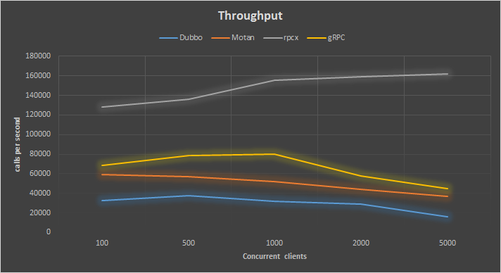
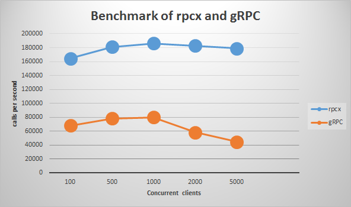
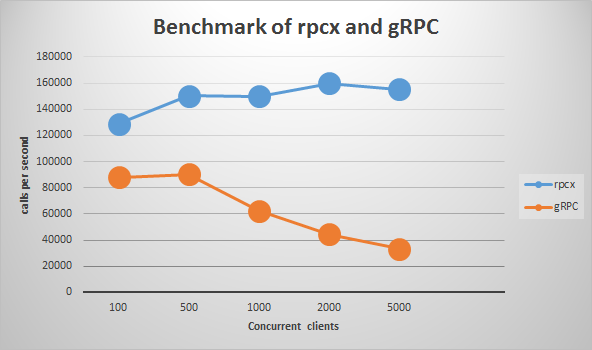

# rpcx
rpcx是一个类似阿里巴巴 [Dubbo](http://dubbo.io/) 和微博 [Motan](https://github.com/weibocom/motan) 的分布式的RPC服务框架，基于Golang net/rpc实现。 

[**中文介绍**](README-CN.md) [**中文电子书**](https://www.gitbook.com/book/smallnest/go-rpc/details)

[](https://opensource.org/licenses/Apache-2.0) [](http://godoc.org/github.com/smallnest/rpcx)   [](https://goreportcard.com/report/github.com/smallnest/rpcx)


rpcx is a distributed RPC framework like [Alibaba Dubbo](http://dubbo.io/) and [Weibo Motan](https://github.com/weibocom/motan).
It is based on Go net/rpc and provides extra governance features.

谈起分布式的RPC框架，比较出名的是阿里巴巴的dubbo,包括由当当网维护的dubbox。
不知道dubbo在阿里的内部竞争中败给了HSF，还是阿里有意将其闭源了，官方的代码使用的spring还停留在2.5.6.SEC03的版本，dubbox的spring也只升级到3.2.9.RELEASE。
不管怎样，dubbo还是在电商企业得到广泛的应用，京东也有部分在使用dubbo开发。



very very good performance. Much better than gRPC, Dubbo and weibo Motan.


When we talk about RPC frameworks, Dubbo is the first framework we should mention, and also Dubbox mantained by dangdang.
Dubbo has been widely used in e-commerce companies in China, for example, Alibaba, Jingdong and Dangdang.

Though Dubbo still uses Spring 2.5.6.SEC03, and is no longer supported by Alibaba, 
some other companies still usea it and maintain their own branches.

Go生态圈已经有一些RPC库，如官方的[net/rpc](https://golang.org/pkg/net/rpc/)、[grpc-go](https://github.com/grpc/grpc-go)、[gorilla-rpc](http://www.gorillatoolkit.org/pkg/rpc)等，为什么还要开发**rpcx**呢？

Motan is open source now by Weibo. As Zhang Lei said, he is the current main developer of Motan:

> Motan started in 2013. There are 100 billion calls for hundreds of service calls every day.

Those two RPC frameworks are developed in Java. 
There are other famous RPC frameworks such as [thrift](https://thrift.apache.org/)、and [finagle](https://github.com/twitter/finagle)。

The goal of [rpcx](https://github.com/smallnest/rpcx) is to implement an RPC framework like Dubbo in Go.
It is developed in Go, and to be used in Go. 

It is a distributed、pluggable RPC framework with governance (service discovery、load balancer、fault tolerance、monitoring, etc.).

As you know, RPC frameworks already exists, for example, [net/rpc](https://golang.org/pkg/net/rpc/)、[grpc-go](https://github.com/grpc/grpc-go)、[gorilla-rpc](http://www.gorillatoolkit.org/pkg/rpc),
So why re-invent the wheel?

Although those Go RPC frameworks work well, their function is relatively simple and they only implement end-to-end communication.
They lack some product features of service management functions like service discovery,
load balancing, and fault tolerance. 

So I created rpcx and expect it to become an RPC framework like Dubbo.

RPC只是描绘了 Client 与 Server 之间的点对点调用流程，包括 stub、通信、RPC 消息解析等部分，在实际应用中，还需要考虑服务的高可用、负载均衡等问题，所以产品级的 RPC 框架除了点对点的 RPC 协议的具体实现外，还应包括服务的发现与注销、提供服务的多台 Server 的负载均衡、服务的高可用等更多的功能。
目前的 RPC 框架大致有两种不同的侧重方向，一种偏重于服务治理，另一种偏重于跨语言调用。

A similar project in go is called [go-micro](https://github.com/micro/go-micro). 

跨语言调用型的 RPC 框架有 Thrift、gRPC、Hessian、Hprose 等，这一类的 RPC 框架重点关注于服务的跨语言调用，能够支持大部分的语言进行语言无关的调用，非常适合于为不同语言提供通用远程服务的场景。但这类框架没有服务发现相关机制，实际使用时一般需要代理层进行请求转发和负载均衡策略控制。

本项目 rpcx 属于服务治理类型，是一个基于 Go 开发的高性能的轻量级 RPC 框架，Motan 提供了实用的服务治理功能和基于插件的扩展能力。

## RPCX的特点

rpcx使用Go实现，适合使用Go语言实现RPC的功能。

* 基于net/rpc,可以将net/rpc实现的RPC项目轻松的转换为分布式的RPC
* 插件式设计，可以配置所需的插件，比如服务发现、日志、统计分析等
* 基于TCP长连接,只需很小的额外的消息头
* 支持多种编解码协议，如Gob、Json、MessagePack、gencode、ProtoBuf等
* 服务发现：服务发布、订阅、通知等，支持多种发现方式如ZooKeeper、Etcd等
* 高可用策略：失败重试（Failover）、快速失败（Failfast）
* 负载均衡：支持随机请求、轮询、低并发优先、一致性 Hash等
* 规模可扩展，可以根据性能的需求增减服务器
* 其他：调用统计、访问日志等

rpcx目标是轻量级的，小而简单，但是期望所有的功能都可以通过插件的方式搭积木的方式完成。

## RPCX架构
rpcx中有服务提供者 RPC Server，服务调用者 RPC Client 和服务注册中心 Registry 三个角色。
* Server 向 Registry 注册服务，并向注册中心发送心跳汇报状态(基于不同的registry有不同的实现)。
* Client 需要向注册中心查询 RPC 服务者列表，Client 根据 Registry 返回的服务者列表，选取其中一个 Sever 进行 RPC 调用。
* 当 Server 发生宕机时，Registry 会监测到服务者不可用(zookeeper session机制或者手工心跳)，Client 感知后会对本地的服务列表作相应调整。client可能被动感知(zookeeper)或者主动定时拉取。
* 可选地，Server可以定期向Registry汇报调用统计信息，Client可以根据调用次数选择压力最小的Server

Dubbo、DubboX、and Motan are RPC frameworks focusing on service governance.
Thrift、gRPC、Hessian、and Hprose are RPC frameworks focusing on cross-language calls.

rpcx focus in on service governance.

rpcx基于Go net/rpc的底层实现， Client和Server之间通讯是通过TCP进行通讯的，它们之间通过Client发送Request，Server返回Response实现。
Request和Response消息的格式都是`Header+Body`的格式。Header和Body具体的格式根据编码方式的不同而不同，可以是二进制，也可以是结构化数据如JSON。


## RPCX的特性
rpcx拥有众多特性。

* Based on net/rpc. a Go net/prc project can be converted to use rpcx with a few changes.
* Pluggable. Features are implemented by Plugins, such as service discovery.
* Communicate with TCP long connections.
* Support GeoLocation
* Support many codec. for example, Gob、Json、MessagePack、gencode、ProtoBuf.
* Service dicovery. support ZooKeeper、Etcd.
* Fault tolerance：Failover、Failfast、Failtry.
* Load banlancer：support randomSelecter, RoundRobin, consistent hashing, etc.
* Scalable.
* Other: metrics、log、timeout.
* Authorization.
* Compression:inflate and snappy.
* Alias name for services.
* [kcp](https://github.com/xtaci/kcp-go) support: a full-featured reliable-UDP library for golang

rpcx has fixed/implemented the below issues in [golang/go rpc](https://github.com/golang/go/issues?utf8=✓&q=is%3Aissue%20rpc) and I believe those issues won't be fixed in the official library because the official rpc library will be frozen.

* [#16449](https://github.com/golang/go/issues/16449): proposal: support custom method names in net/rpc
* [#15236](https://github.com/golang/go/issues/15236): net/rpc: expected Timeout based alternatives to functions for rpc.Dial, rpc.DialHTTP, rpc.DialHTTPPath [proposal].
* [#13395](https://github.com/golang/go/issues/13395): net/rpc: Server.ServeHTTP assumes default http mux
* [#10929](https://github.com/golang/go/issues/10929): net/rpc/jsonrpc: Missing support for JSON-RPC 2.0
* [#7946](https://github.com/golang/go/issues/7946): net/rpc: add client support for RPC over https
* [#4591](https://github.com/golang/go/issues/4591): Authentication for RPC and HTTP
* [#4584](https://github.com/golang/go/issues/4584): net/rpc: access to client's IP address
* [#3615]()https://github.com/golang/go/issues/3615: rpc: allow aliasing methods


[rpcx-ui](https://github.com/smallnest/rpcx-ui) provides a web ui for services management.


## Architecture
rpcx contains three roles : RPC Server，RPC Client and Registry.
* Server registers services on the Registry
* Client queries the service list and select a server from the server list returned from the Registry.
* When a Server is down, the Registry can remove the server from the list, and subsequently the client can remove it too.

| 特性 | 功能描述  | 
| -- | -- |
| [gob](https://golang.org/pkg/encoding/gob/) |官方提供的序列化方式，基于一个包含元数据的流 |
| [jsonrpc](https://golang.org/pkg/net/rpc/jsonrpc/)|也是官方提供的编码库，以JSON格式传输 |
|[msgp](http://msgpack.org/)|类似json格式的编码，但是更小更快，可以直接编码struct |
|[gencode](https://github.com/andyleap/gencode)|一个超级快的序列化库，需要定义schema,但是定义方式和struct类似 |
|[protobuf](https://github.com/google/protobuf)|Google推出的广受关注的序列化库，推荐使用[gogo-protobuf](https://github.com/gogo/protobuf)，可以获得更高的性能|

在数据结构简单的情况下，这几种库都可以满足需求，参照本文中的benchmark测试。但是如果追求性能，建议采用后面三种序列化库。

序列化库的选择对于RPC服务的影响是巨大的，我创建了另外一个项目专门比较各序列化库的性能： [gosercomp](https://github.com/smallnest/gosercomp)。

新的序列化库的实现也非常简单，只需实现下面两个方法即可：
```go 
func NewXXXXXServerCodec(conn io.ReadWriteCloser) rpc.ServerCodec {
    ……
}
func NewXXXXXClientCodec(conn io.ReadWriteCloser) rpc.ClientCodec {
    ……
}
```

编码库负责marshal/unmarshal Reuqest/Response， 包括消息中的Header和Body。
如果你想，你也可以对Header和Body实现不同的编码。

#### 注册中心 
目前提供了两种注册中心:

* ZooKeeperRegisterPlugin
通过ZooKeeper实现服务发现。
服务在注册的时候会自动在ZooKeeper上创建一个Ephemeral节点，因此当服务宕机的时候此节点就被删除，Client也会感知到。
同时，Server也会把调用次数定时更新到ZooKeeper，这样Client可以根据一段时间的调用次数选择压力较小的服务器节点进行连接。


注册中心的配置只需在服务器初始化的时候增加以下代码，服务的实现无需做任何的改动，也不需要额外的配置。
```go 
	plugin := &ZooKeeperRegisterPlugin{
		ServiceAddress:   "tcp@127.0.0.1:1234",
		ZooKeeperServers: []string{"127.0.0.1:2181"},
		BasePath:         "/rpcx",
		metrics:          metrics.NewRegistry(),
		Services:         make([]string, 1),
		updateInterval:   time.Minute,
	}
    server.PluginContainer.Add(plugin)
```

其中ServiceAddress为本机(Server)要暴露给Client地址。因为ZooKeeper的节点名不支持"/"，
所以此处用"@"代替"://"。

ZooKeeperServers为ZK集群的地址。

BasePath为一个服务组，此组下的服务对于Client都是可见的。


* EtcdRegisterPlugin
通过etcd也可以实现服务发现。

etcd可以通过TTL判断服务器的存活，另外此插件也会定时把调用次数定时更新到etcd。

此插件可以使用下面的代码配置：
```go 
	plugin := &EtcdRegisterPlugin{
		ServiceAddress: "tcp@127.0.0.1:1234",
		EtcdServers:    []string{"http://127.0.0.1:2379"},
		BasePath:       "/rpcx",
		metrics:        metrics.NewRegistry(),
		Services:       make([]string, 1),
		updateInterval: time.Minute,
	}
    server.PluginContainer.Add(plugin)
```


注意注册中心插件必须在配置服务之前设置，否则注册中心无法获取要注册的服务信息。


#### 扩展点
当前rpcx为server提供了以下扩展点：

* 服务注册时
* Client连接时
* 读取Request Header的前后
* 读取Request Body的前后
* 返回Response的前后

你可以根据这些扩展点编写自己的插件，只需实现相应的接口即可。
定义的接口你可以看godoc的IXXXXXXPlugin的定义。

So far rpcx supports ZooKeeper and Etcd as Registry，Consul support is in developement.

## Examples

There is a client calling the Posts service at tr.colobu.com. This service returns a hot tech post list of the day:
```go 
package main

import (
	"encoding/json"
	"fmt"
	"time"

	"gopkg.in/mgo.v2/bson"

	"github.com/smallnest/rpcx"
)

type Args struct {
	PostType string `msg:"posttype"`
}

type Reply struct {
	Posts []Post `msg:"posts"`
}

type Post struct {
	PostID      bson.ObjectId `json:"id" xml:"id" bson:"_id,omitempty"`
	PostType    string        `json:"ptype" xml:"ptype" bson:"ptype,omitempty"`
	Title       string        `json:"title" xml:"title" bson:"title"`
	URL         string        `json:"url" xml:"url" bson:"url"`
	Domain      string        `json:"domain" xml:"domain" bson:"domain"`
	ShortURL    string        `json:"surl" xml:"surl" bson:"surl"`
	Description string        `json:"desc" xml:"desc" bson:"desc"`
	LikeCount   int           `json:"like" xml:"like" bson:"like"`
	ImageURL    string        `json:"imgurl" xml:"imgurl" bson:"imgurl"`
	RecommendBy string        `json:"-" xml:"-" bson:"-"`
	Tags        string        `json:"tags" xml:"tags" bson:"tags"`
	State       int           `json:"-" xml:"-" bson:"-"`
	Timestamp   time.Time     `json:"ts" xml:"timestamp" bson:"ts"`
}

func main() {
	s := &rpcx.DirectClientSelector{Network: "tcp", Address: "tr.colobu.com:8972", DialTimeout: 10 * time.Second}
	client := rpcx.NewClient(s)
	defer client.Close()

	args := &Args{"golang"}
	var reply Reply
	err := client.Call("Posts.Query", args, &reply)
	if err != nil {
		fmt.Printf("error for Posts: %s, %v \n", args.PostType, err)
		return
	}

	posts := reply.Posts
	data, _ := json.MarshalIndent(&posts, "", "\t")

	fmt.Printf("Posts: %s \n", string(data))
}
```

you can found more examples at [_examples](_examples)


## Benchmark

**测试环境**
* CPU:    Intel(R) Xeon(R) CPU E5-2620 v2 @ 2.10GHz, 24 cores
* Memory: 16G
* OS:     Linux Server-3 2.6.32-358.el6.x86_64, CentOS 6.4
* Go:     1.7

Test request is copied from protobuf project and encoded to a proto message. Its size is 581 bytes.
The response update two fields of decoded requests so the server goes through decoding and encoding.

The test proto file is:

```proto
syntax = "proto2";

package main;

option optimize_for = SPEED;


message BenchmarkMessage {
  required string field1 = 1;
  optional string field9 = 9;
  optional string field18 = 18;
  optional bool field80 = 80 [default=false];
  optional bool field81 = 81 [default=true];
  required int32 field2 = 2;
  required int32 field3 = 3;
  optional int32 field280 = 280;
  optional int32 field6 = 6 [default=0];
  optional int64 field22 = 22;
  optional string field4 = 4;
  repeated fixed64 field5 = 5;
  optional bool field59 = 59 [default=false];
  optional string field7 = 7;
  optional int32 field16 = 16;
  optional int32 field130 = 130 [default=0];
  optional bool field12 = 12 [default=true];
  optional bool field17 = 17 [default=true];
  optional bool field13 = 13 [default=true];
  optional bool field14 = 14 [default=true];
  optional int32 field104 = 104 [default=0];
  optional int32 field100 = 100 [default=0];
  optional int32 field101 = 101 [default=0];
  optional string field102 = 102;
  optional string field103 = 103;
  optional int32 field29 = 29 [default=0];
  optional bool field30 = 30 [default=false];
  optional int32 field60 = 60 [default=-1];
  optional int32 field271 = 271 [default=-1];
  optional int32 field272 = 272 [default=-1];
  optional int32 field150 = 150;
  optional int32 field23 = 23 [default=0];
  optional bool field24 = 24 [default=false];
  optional int32 field25 = 25 [default=0];
  optional bool field78 = 78;
  optional int32 field67 = 67 [default=0];
  optional int32 field68 = 68;
  optional int32 field128 = 128 [default=0];
  optional string field129 = 129 [default="xxxxxxxxxxxxxxxxxxxxx"];
  optional int32 field131 = 131 [default=0];
}
```


The test is run with 100, 1000, 2000 and 5000 concurrent clients. The total number of requests per clients is 1,000,000.


### rpcx: one client and one server on the same machine
concurrent clients|mean(ms)|median(ms)|max(ms)|min(ms)|throughput(TPS)
-------------|-------------|-------------|-------------|-------------|-------------
100|0|0|17|0|164338
500|2|1|40|0|181126
1000|4|3|56|0|186219
2000|9|7|105|0|182815
5000|25|22|200|0|178858

随着并发数的增大，服务器延迟也越长，这是正常的。

当并发数为1000的时候吞吐率可以达到12万，这是相当理想的数据。但是随着并发数的增大，吞吐率也急剧下降，因此并发数不要设置太大，1000以内为宜。

The above test is with a client and a server running on the same mechine.

### rpcx: one client and one server running on different machines

If I run them on separate servers, the test results are:

并发client|平均值(ms)|中位数(ms)|最大值(ms)|最小值(ms)|吞吐率(TPS)
-------------|-------------|-------------|-------------|-------------|-------------
100|1|1|20|0|127975
500|5|1|4350|0|136407
1000|10|2|3233|0|155255
2000|17|2|9735|0|159438
5000|44|2|12788|0|161917 

### rpcx: one client on one machine and two servers on two machines

When running in cluster mode, with one machine with one client and another two running as servers, the test results are:

如果部署成集群的模式，一个客户端，两个服务器端，测试结果如下：

并发client|平均值(ms)|中位数(ms)|最大值(ms)|最小值(ms)|吞吐率(TPS)
-------------|-------------|-------------|-------------|-------------|-------------
100|0|0|41|0|128932
500|3|2|273|0|150285
1000|5|5|621|0|150152
2000|10|7|288|0|159974
5000|23|12|629|0|155279


### benchmarks of serialization libraries:

```
[root@localhost rpcx]# go test -bench . -test.benchmem
PASS
BenchmarkNetRPC_gob-16            100000             18742 ns/op             321 B/op          9 allocs/op
BenchmarkNetRPC_jsonrpc-16        100000             21360 ns/op            1170 B/op         31 allocs/op
BenchmarkNetRPC_msgp-16           100000             18617 ns/op             776 B/op         35 allocs/op
BenchmarkRPCX_gob-16              100000             18718 ns/op             320 B/op          9 allocs/op
BenchmarkRPCX_json-16             100000             21238 ns/op            1170 B/op         31 allocs/op
BenchmarkRPCX_msgp-16             100000             18635 ns/op             776 B/op         35 allocs/op
BenchmarkRPCX_gencodec-16         100000             18454 ns/op            4485 B/op         17 allocs/op
BenchmarkRPCX_protobuf-16         100000             17234 ns/op             733 B/op         13 allocs/op
```

## Comparision with gRPC
[gRPC](https://github.com/grpc/grpc-go) is the RPC framework by Google. It supports multiple programming lanaguage.
I have compared three cases for prcx and gRPC. It shows rpcx is much better than gRPC.

current gRPC version is 1.0.

The test results for rpcx can be found above. Below is the test results for gRPC.

### gRPC: one client and one server on the same machine
concurrent clients|mean(ms)|median(ms)|max(ms)|min(ms)|throughput(TPS)
-------------|-------------|-------------|-------------|-------------|-------------
100|1|0|21|0|68250
500|5|1|3059|0|78486
1000|10|1|6274|0|79980
2000|19|1|9736|0|58129
5000|43|2|14224|0|44724




### gRPC: one client and one server running on different machines
concurrent clients|mean(ms)|median(ms)|max(ms)|min(ms)|throughput(TPS)
-------------|-------------|-------------|-------------|-------------|-------------
100|1|0|21|0|68250
500|5|1|3059|0|78486
1000|10|1|6274|0|79980
2000|19|1|9736|0|58129
5000|43|2|14224|0|44724 


### gRPC: one client on one machine and two servers on two machines
concurrent clients|mean(ms)|median(ms)|max(ms)|min(ms)|throughput(TPS)
-------------|-------------|-------------|-------------|-------------|-------------
100|1|0|19|0|88082
500|4|1|1461|0|90334
1000|9|1|6315|0|62305
2000|17|1|9736|0|44487
5000|38|1|25087|0|33198



